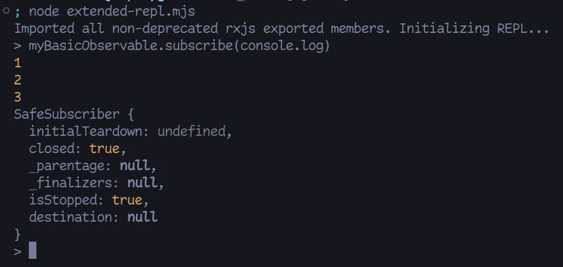

# rxjs-playground

## Installation

Only one requirement: [`rxjs`](https://rxjs.dev).

```sh
npm install
```

## Use

Simply run the `start` script to open a REPL in which all the exposed interfaces
of `rxjs` are available at the top level, as if you had imported them from a
module.

```
$ npm start

> rxjs-playground@1.0.0 start
> node rxjs-playground.mjs

Imported all non-deprecated rxjs exported members. Initializing REPL...
>
```

## Extend

The main module exports its REPL server, so you can import it in another script
and extend it with your own code. An example (see [extended-repl.mjs]):
```javascript
import { of } from 'rxjs';
import { server } from './rxjs-playground.mjs';

const myBasicObservable = of(1, 2, 3);

server.context.myBasicObservable = myBasicObservable;
```

Running this script, you can access `myBasicObservable` as a top level const:



With this mechanism you can prepare complex streams with piped operators and you
don't have to worry about copying code into the REPL directly when you want to
inspect the result of a complex interaction with the stream. This is extremely
useful when writing code challenges and examples.